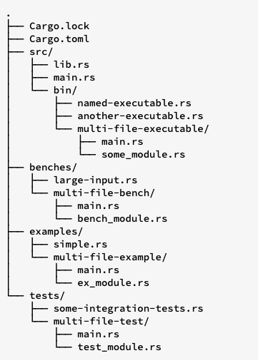

### 项目结构说明

这也是 Cargo 推荐的目录结构，解释如下：

- Cargo.toml 和 Cargo.lock 保存在 package 根目录下
- 源代码放在 src 目录下
- 默认的 lib 包根是 src/lib.rs
- 默认的二进制包根是 src/main.rs
  - 其它二进制包根放在 src/bin/ 目录下
- 基准测试 benchmark 放在 benches 目录下
- 示例代码放在 examples 目录下
- 集成测试代码放在 tests 目录下